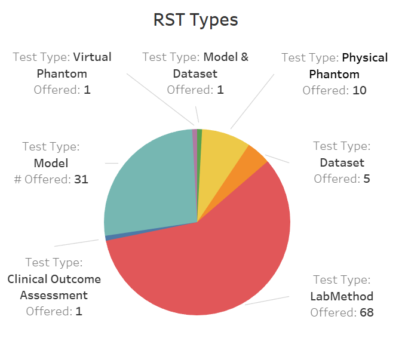
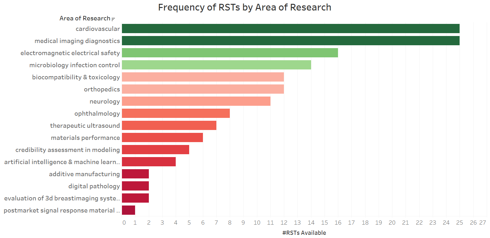
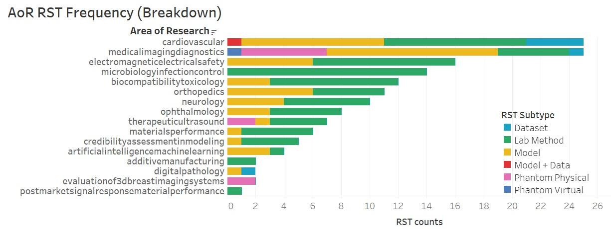
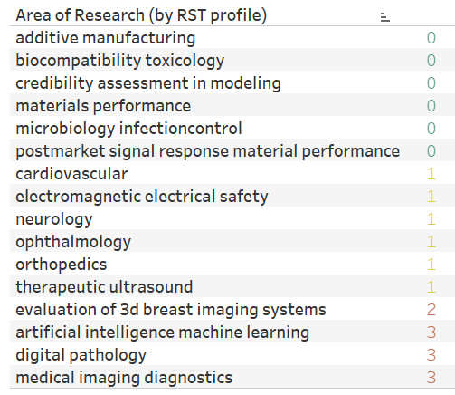
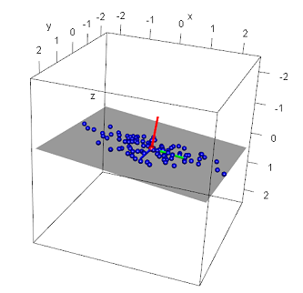
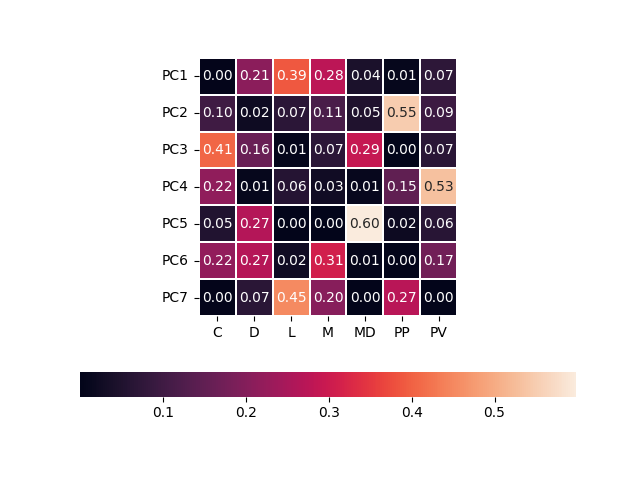

# Regulatory_Tools

<h2><b>1. Project Introduction</b></h2>
The purpose of FDA Regulatory Science Tools (<b>RSTs</b>), developed by the FDA-CDRH's Office of Science and Engineering Labs (<b>OSEL</b>), is to assist in the development of new medical technologies.  A variety of distinct RSTs are available for a variety of Areas of Research (<b>AORs</b>), ranging from Neurology to Toxicology and Medical Imaging.  
A rationale for the following analysis is to facilitate decision-making in the generation of new RSTs (a potentially resource-intensive process), by determining patterns and anomalies in the availability of existing RSTs.    

<b><h2>2. Analyses</h2></b>
Initially, <b>Regulatory_Tools</b> analyzes the 117 RSTs offered by FDA-OSEL in five manners:</h3> 
  1. The availability of RSTs by industry type.  
  2. The availability of RSTs by tool type (i.e. Laboratory Method, etc.).  
  3. How RST tool types serve various areas of research.  
  4. Clustering AORs by their respective RST subtypes. This allows for qualitative detection of <b>anomalies* in RST availability</b> across similar AORs.  
  5. Principal Component Analysis ([<b>PCA</b>](#PCA)) on the availability of RST subtypes across each AoR.  This will serve as a (simplistically-put) means to determine which RST subtypes tend to hold the least <i>identification value</i> for AoRs ([intuition explained down below](#PCA)).  PCAs are classically conducted to determine whether highly-featured data can be collapsed into fewer, artificial/composite features ("principal components").

 *An example of an anomaly would be the availability of "physical phantoms" (an RST subtype) for "ultrasound imaging" (an AoR), but not "x-ray imaging" (another AoR). 

The data for these analyses are extracted from the [Catalog of Regulatory Science Tools to Help Assess New Medical Devices](https://www.fda.gov/medical-devices/science-and-research-medical-devices/catalog-regulatory-science-tools-help-assess-new-medical-devices).

Next, open-source industry data is integrated to offer three additional analyses: 
  6. Interactions between RST parameters and industry size.  
  7. Interactions between RST parameters and industry growth.  
  8. Interactions between RST parameters and industry employment   

A quick preview of the processed data: 

 

<b>The seven primary forms of RSTs on offer</b>  
 

  

<b><h2>3. How the program works:</h2></b>
  1. String data extracted, cleaned, stripped, lemmatized from [Excel file of RST data](datafiles\catalogofrsts.xlsx).  
  2. Areas of Research reduced (Neurology Oncology -> Neurology) by root words (i.e. "Neurology").  
  3. Pushes data to PostgreSQL server to store data.  
  4. Uses SQL retrieve and form relevant tables.  
  5. Uses Python (sklearn) to perform higher level inferences such as PCA and clustering. Hand-coded modifications I've demonstrated [here](https://github.com/jkhsong/bloodpartML).   

<b><h2>4. Interpretations:</h2></b>

<i> First thought: Many of the following interpretations are correlations, and must be presented with context (or scientifically tested with control data to determine <b><i>causes</i></b>) to be useful to a policy-maker.</i>
 

&nbsp;&nbsp;&nbsp;&nbsp;&nbsp;&nbsp;<b>Table 1</b> indicates that medical imaging and cardiovascular applications are the most served areas of research regarding RST availability, followed by other clinical disciplines, microbiology and infection control, as well as biocompatibility/toxicology.  Least-served areas were materials and manufacturing, and digital or computational tools. 

<b>Table 1. Area of Research.</b>
| Area of Research                            |   #RSTs Available |
|:--------------------------------------------|:-----------------:|
| additivemanufacturing                       |                 2 |
| artificialintelligencemachinelearning       |                 4 |
| biocompatibilitytoxicology                  |                12 |
| cardiovascular                              |                25 |
| credibilityassessmentinmodeling             |                 5 |
| digitalpathology                            |                 2 |
| electromagneticelectricalsafety             |                16 |
| evaluationof3dbreastimagingsystems          |                 2 |
| materialsperformance                        |                 6 |
| medicalimagingdiagnostics                   |                25 |
| microbiologyinfectioncontrol                |                14 |
| neurology                                   |                11 |
| ophthalmology                               |                 8 |
| orthopedics                                 |                12 |
| postmarketsignalresponsematerialperformance |                 1 |
| therapeuticultrasound                       |                 7 |

 

 
 

  

&nbsp;&nbsp;&nbsp;&nbsp;&nbsp;&nbsp;Out of 117 listings, <b>Tables 2</b> and <b>3</b> indicate that the two most common types of RSTs offered were Laboratory Methods and Computational Tools (Models), which represented 84.7% of all RST types on offer.  Interestingly, the remainder of tools such as Datasets, Phantoms, and Clinical Outcome Assessments represented just 15.3% of all RST types. 

<b>Table 2. Types of RSTs.</b>
| Type of RSTs              |   Counts |
|:--------------------------|:--------:|
| ClinicalOutcomeAssessment |        1 |
| Dataset                   |        5 |
| LabMethod                 |       68 |
| Model                     |       31 |
| ModelDataset              |        1 |
| PhantomPhysical           |       10 |
| PhantomVirtual            |        1 |

<b>Table 3. RST subtypes offered by Area of Research.</b>
| Area of Research               |   ClinicalAssess            |   Dataset |   LabMethod |   Model |   ModelDataset |   PhantomPhysical |   PhantomVirtual |
|:-------------------------------|:---------------------------:|:---------:|:-----------:|:-------:|:--------------:|:-----------------:|:----------------:|
| additivemanufacturing          |                           0 |         0 |           2 |       0 |              0 |                 0 |                0 |
| artificialintelligence         |                           0 |         0 |           1 |       3 |              0 |                 0 |                0 |
| biocompatibilitytoxicology     |                           0 |         0 |           9 |       3 |              0 |                 0 |                0 |
| cardiovascular                 |                           0 |         4 |          10 |      10 |              1 |                 0 |                0 |
| credibilitymodeling            |                           0 |         0 |           4 |       1 |              0 |                 0 |                0 |
| digitalpathology               |                           0 |         1 |           0 |       1 |              0 |                 0 |                0 |
| electromagneticelectricalsafety|                           0 |         0 |          10 |       6 |              0 |                 0 |                0 |
| 3dbreastimagingsystems         |                           0 |         0 |           0 |       0 |              0 |                 2 |                0 |
| materialsperformance           |                           0 |         0 |           5 |       1 |              0 |                 0 |                0 |
| medicalimagingdiagnostics      |                           0 |         1 |           5 |      12 |              0 |                 6 |                1 |
| microbiologyinfectioncontrol   |                           0 |         0 |          14 |       0 |              0 |                 0 |                0 |
| neurology                      |                           1 |         0 |           6 |       4 |              0 |                 0 |                0 |
| ophthalmology                  |                           0 |         0 |           5 |       3 |              0 |                 0 |                0 |
| orthopedics                    |                           1 |         0 |           5 |       6 |              0 |                 0 |                0 |
| materialperformance            |                           0 |         0 |           1 |       0 |              0 |                 0 |                0 |
| therapeuticultrasound          |                           0 |         0 |           4 |       1 |              0 |                 2 |                0 |

 

 
 

  

<b>Table 4</b> indicates that clustering Areas of Research by each area's count and type of RST offerings indicates: 
  1. Cardiovascular and Medical Imaging (areas of research) share similar RST counts and types--This is interesting coming from an ultrasound background, in which echocardiography (a medical imaging subtype involving heart imaging) is a preeminent application. 
  2. Areas involving technologies with nascent biomedical applications (i.e. additive manufacturing) and computational research are marked by a similar count and ratio of lab-method/computational type RSTs on offer. 
  3. Areas involving biomedical materials and clinical disciplines (i.e. neurology, opthamology, orthopedics) are marked by a high number of lab methods and computational models. 
  4. Microbiology and Infection Control stands alone in that their RSTs are exclusively lab methods.  

<!--  

 
<b>Table 4a. Colorized-by-category: Cluster K-Means clustering of Research Areas by normalized RST vectors.</b>  
 

   -->

<b>Table 4b. K-Means Clustering of Research Areas by RST vectors.</b>
| Area of Research                            |   Category | RSTs (C, D, L, M, MD, PP, PV)|
|:--------------------------------------------|-----------:|:-------------------------:|
| additivemanufacturing                       |          0 | (0, 0, 2, 0, 0, 0, 0)     |
| artificialintelligencemachinelearning       |          0 | (0, 0, 1, 3, 0, 0, 0)     |
| credibilityassessmentinmodeling             |          0 | (0, 0, 4, 1, 0, 0, 0)     |
| digitalpathology                            |          0 | (0, 1, 0, 1, 0, 0, 0)     |
| evaluationof3dbreastimagingsystems          |          0 | (0, 0, 0, 0, 0, 2, 0)     |
| postmarketsignalresponsematerialperformance |          0 | (0, 0, 1, 0, 0, 0, 0)     |
| therapeuticultrasound                       |          0 | (0, 0, 4, 1, 0, 2, 0)     |
| cardiovascular                              |          1 | (0, 4, 10, 10, 1, 0, 0)   |
| medicalimagingdiagnostics                   |          1 | (0, 1, 5, 12, 0, 6, 1)    |
| microbiologyinfectioncontrol                |          2 | (0, 0, 14, 0, 0, 0, 0)    |
| biocompatibilitytoxicology                  |          3 | (0, 0, 9, 3, 0, 0, 0)     |
| electromagneticelectricalsafety             |          3 | (0, 0, 10, 6, 0, 0, 0)    |
| materialsperformance                        |          3 | (0, 0, 5, 1, 0, 0, 0)     |
| neurology                                   |          3 | (1, 0, 6, 4, 0, 0, 0)     |
| ophthalmology                               |          3 | (0, 0, 5, 3, 0, 0, 0)     |
| orthopedics                                 |          3 | (1, 0, 5, 6, 0, 0, 0)     |

  
Next, RSTs were normalized by total RSTs per research area. Previously, we saw that new or more emergent areas of biomedical research (digital pathology, additive manufcaturing, AI and machine learning) had fewer available RSTs.  I hypothesized that normalizing RST vectors by total RST count would reduce the effect that research area <i>age</i> may have on classifcation. Interestingly, <b>Table 5</b> indicates that significant differences in classification with <b>Table 4</b> are achieved via normalization, however: 
  1. We see that computational predominantly remain together in category 3, indicating that RSTs developed for these areas of research have largely been of similar types. 
  2. Similar RST types are offered for materials research, biocompatibility, and microbiology/infection control (which was previously in a category of its own).  
  3. "Evaluation of 3D Breast Imaging Systems" now resides in its own category, due to its exclusive reliance on Physical Phantoms as RST type. 
  4. Interestingly, all of the clinical research areas (opthalmology, neurology, cardiovascular, orthopedics) clustered together according to normalized RST types.  This suggests that the type of RST offerings are largely similar for these areas of research, which is understandable--A computational model is largely accompanied by laboratory assays.  What may be counter-intuitive are discipline such as microbiology/infection control residing outside this regime of classical testing schemes.  

<b>Table 5. K-Means Classications of Research Areas by <i>normalized</i> RST vectors.</b>
| Area of Research                            |   Category | RSTs (C, D, L, M, MD, PP, PV)           |
|:--------------------------------------------|:----------:|:---------------------------------------:|
| additivemanufacturing                       |          0 | (0.0, 0.0, 1.0, 0.0, 0.0, 0.0, 0.0)     |
| biocompatibilitytoxicology                  |          0 | (0.0, 0.0, 0.75, 0.25, 0.0, 0.0, 0.0)   |
| credibilityassessmentinmodeling             |          0 | (0.0, 0.0, 0.8, 0.2, 0.0, 0.0, 0.0)     |
| materialsperformance                        |          0 | (0.0, 0.0, 0.83, 0.17, 0.0, 0.0, 0.0)   |
| microbiologyinfectioncontrol                |          0 | (0.0, 0.0, 1.0, 0.0, 0.0, 0.0, 0.0)     |
| postmarketsignalresponsematerialperformance |          0 | (0.0, 0.0, 1.0, 0.0, 0.0, 0.0, 0.0)     |
| cardiovascular                              |          1 | (0.0, 0.16, 0.4, 0.4, 0.04, 0.0, 0.0)   |
| electromagneticelectricalsafety             |          1 | (0.0, 0.0, 0.62, 0.38, 0.0, 0.0, 0.0)   |
| neurology                                   |          1 | (0.09, 0.0, 0.55, 0.36, 0.0, 0.0, 0.0)  |
| ophthalmology                               |          1 | (0.0, 0.0, 0.62, 0.38, 0.0, 0.0, 0.0)   |
| orthopedics                                 |          1 | (0.08, 0.0, 0.42, 0.5, 0.0, 0.0, 0.0)   |
| therapeuticultrasound                       |          1 | (0.0, 0.0, 0.57, 0.14, 0.0, 0.29, 0.0)  |
| evaluationof3dbreastimagingsystems          |          2 | (0.0, 0.0, 0.0, 0.0, 0.0, 1.0, 0.0)     |
| artificialintelligencemachinelearning       |          3 | (0.0, 0.0, 0.25, 0.75, 0.0, 0.0, 0.0)   |
| digitalpathology                            |          3 | (0.0, 0.5, 0.0, 0.5, 0.0, 0.0, 0.0)     |
| medicalimagingdiagnostics                   |          3 | (0.0, 0.04, 0.2, 0.48, 0.0, 0.24, 0.04) |

 
<h3><b>Principal Component Analysis of RSTs</b></h3>
<h4><i>The intuition, for my friends that are/were curious:</i></h4>
Principal components are composites of features which help reduce the dimensionality of data.  Imagine you wanted to flatten a 3-dimensional scatter plot (3 continuous features) into a 2-dimensional plot (2 continuous features).  You could imagine that you could slice by any of the following planes: X-Y, X-Z, Y-Z (corresponding to a Z = C, Y = C, or X = C graphing function, respectively, where C is some constant).  Whichever plane you picked to flatten across, you would want to preserve the most information about the relative position of each point in the scatter plot.  What PCA lets us accomplish (as an anology) is: Determine a plane (sometimes tilted) that give us the "best flatten" that preserves the most information.  For example, if your data points were scattered in diagonally across 3D space (but spread out along that plane), you could preserve the most information by flattening them along the plane they sit on.  If this plane cannot simply be described as one formed by Z = C, Y = C or X =C, then each plane will be formed by contributions from several dimensions (i.e. A*Z = B*X + C*Y, where A, B, Cs are coefficients.  Note how both Z and X describe a plane here).  A principal component (<b>PC</b>) is similar, but it describes the data, already processed, in terms of variance along all of its axes (information). 

 

 
<b>Diagonal plane placed through points mostly on a diagonal plane. Image c/o <a href="https://www.algosome.com/articles/pca-three-dimensions-point-cloud.html">Algosome</a>.</b>  
 

  

<h4><i>Applying PCA to RSTs:</i><h4>
The first four "best" principal components are mostly comprised of Laboratory Methods (L) and Math Models (M), Physical Phantoms (PP), Clinical Assessments (C), and Virtual Phantoms (PV).  This makes sense, since these tend to be the most "constant" in terms of relationality--For example, there are very few AoRs that use Virtual Phantoms (exactly one--medical imaging diagnostics).  That means that a lot of variance can be preserved by weighting our PCA to "flatten" along Virtual Phantoms.  It is a bit of a surprise that Lab Methods and Math Models would provide our best "flatten", but on closer inspection of Table 3 and 4, we can see that they scale with each other.   

 

 
<b>PCAs and their component compositions.</b>  
 

  

Therefore, applying PCA shows that almost all (5 out of 6) possible components are necessary to account for 94% of the variability in the data.  This likely means that any learning model would do well to work on the raw data (and thankfully, there are only 16 samples/AORs and 7 features/RST subtypes).  Creatively, what it means is that distinguishing AORs by their numeric RST profiles would likely require most of the information we have about their RST subtypes.   

 
<h2><b>5. Conclusion</b></h3>

&nbsp;&nbsp;&nbsp;&nbsp;&nbsp;&nbsp;It is worth noting that RSTs are organically developed on circumstance and needs, and cluster analysis is predominantly used to classify items with similar attributes (i.e. classifying fish type by length, width, and weight). 

&nbsp;&nbsp;&nbsp;&nbsp;&nbsp;&nbsp;However, in our case, cluster analysis can indicate what future RST types may be for less-served areas of research. An example of this is "Evaluation of 3D imaging systems":  We can imagine that such a discipline would benefit from additional models, datasets, and lab methods, much like its nearest neighbors "Therapeutic Ultrasound". 

